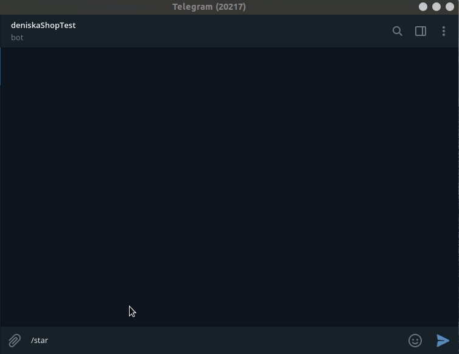

Этот проект магазина по продаже рыбы в Телеграмм боте, написанный на базе
["Elastic Path Commerce Cloud".](https://elasticpath.dev/docs/getting-started/overview) 

## Пример общения телеграмм бота.



## Готового бота вы можете протестировать по ссылке:
* telegram - @fish_shop123_bot

## Проект содержит 3и скрипта:
* `elasticpath_api.py` - Скрипт содержит набор функций для общения по АПИ с 
  онлайн сервисом для реализации своего собственного магазина.
* `fish_tg_bot.py` - Скрипт осуществляет выдачу данных из интернет магазина,
  в телеграмм бота.
* `logs_handler.py` - Скрипт содержит вспомогательный хендлер для отправки 
  логов с ошибками в telegram.

## Установка

Используйте данную инструкцию по установке этого скрипта

1. Установить

```python
git clone https://github.com/Maxim-Pekov/fish-tg-shop.git
```

2. Создайте виртуальное окружение:

```python
python -m venv venv
```

3. Активируйте виртуальное окружение:
```python
.\venv\Scripts\activate    # for Windows
```
```python
source ./.venv/bin/activate    # for Linux
```

4. Перейдите в директорию `fish-tg-shop`
5. Установите зависимости командой ниже:
```python
pip install -r devman_bot/requirements.txt
```

6. Создайте файл с названием `.env` со следующим содержимым:
```python
#Токен вашего бота полученный от BotFather
TG_API_TOKEN=*********:AAEslg7Dze3mh5_Ftmru248FjxRfK******

#Секретный ключ, Токен активации и ID_клиента сервиса Elasticpath
SECRET_KEY=**********eUD7Dun6Z3NUxkqofwZ9tM**********
ACCESS_TOKEN=**********c432d9ccd0d2513db722**********
CLIENT_ID=**********IQExNYg0lAoo1jNFWG1534**********

#Пароль, хост и порт от вашего соединения с БД Редис
REDIS_PASSWORD=**********0MzcuQiDdDf0*********
REDIS_HOST=redis-18142.c12.us-east-1-4.ec2.cloud.redislabs.com
REDIS_PORT=11111
```

## About me

[https://www.linkedin.com/in/maxim-pekov/](https://www.linkedin.com/in/maxim-pekov/)
</br>

[https://t.me/MaxPekov/](https://t.me/MaxPekov/)
</br>

[//]: # (Карточка профиля: )


[//]: # (Статистика языков в коммитах:)

[//]: # (Статистика языков в репозиториях:)


[//]: # (Статистика профиля:)

[//]: # (Данные по коммитам за сутки:)


[//]: # ([![trophy]&#40;https://github-profile-trophy.vercel.app/?username=Maxim-Pekov&#41;]&#40;https://github.com/ryo-ma/github-profile-trophy&#41;)

